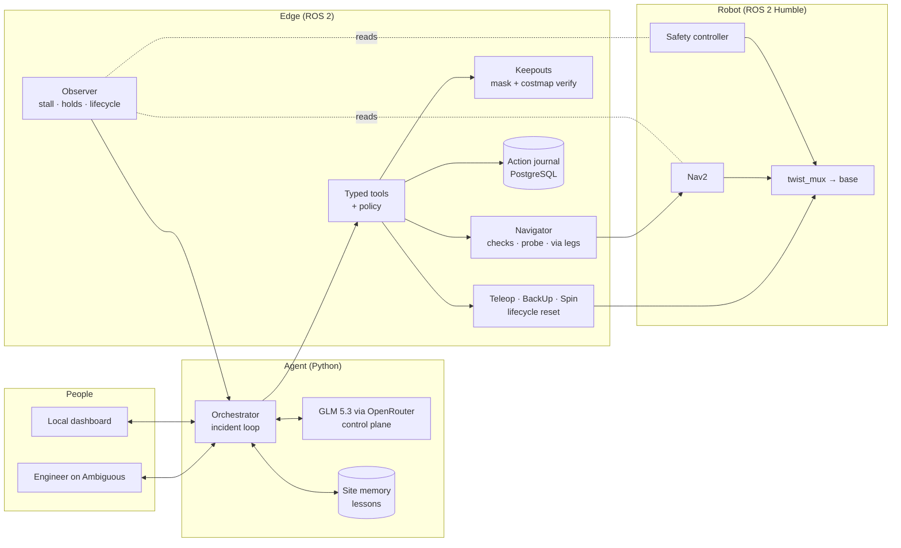
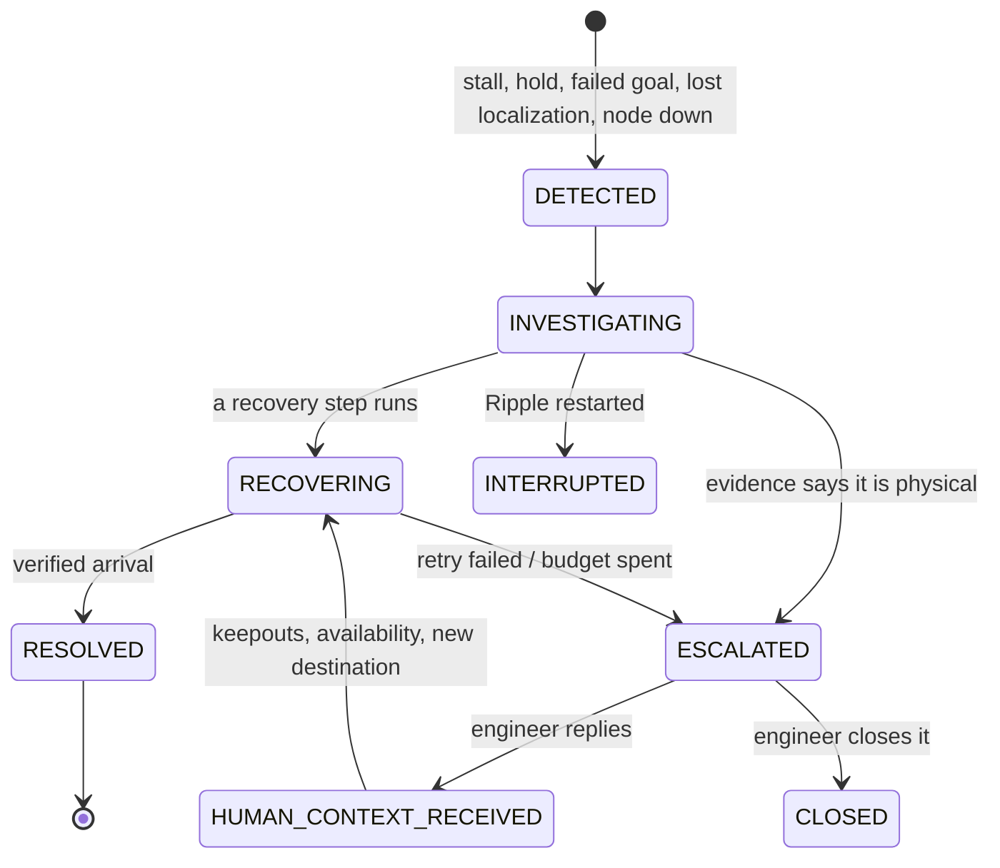
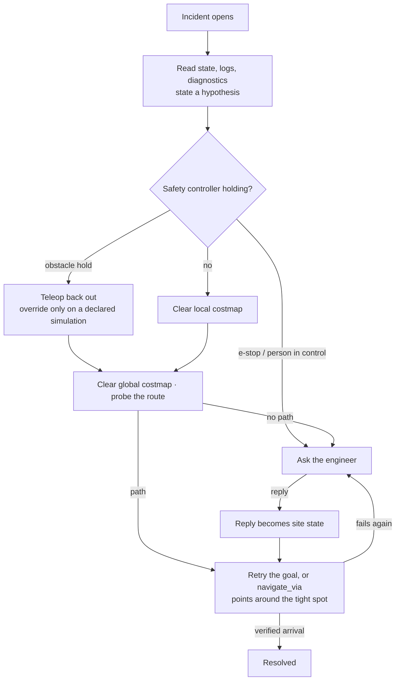
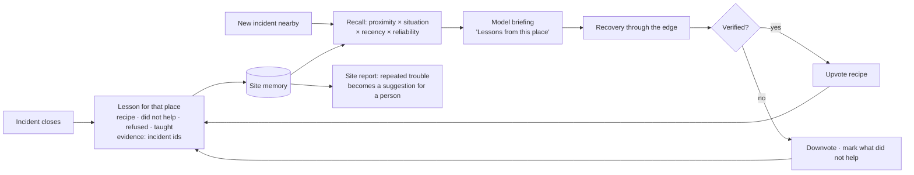
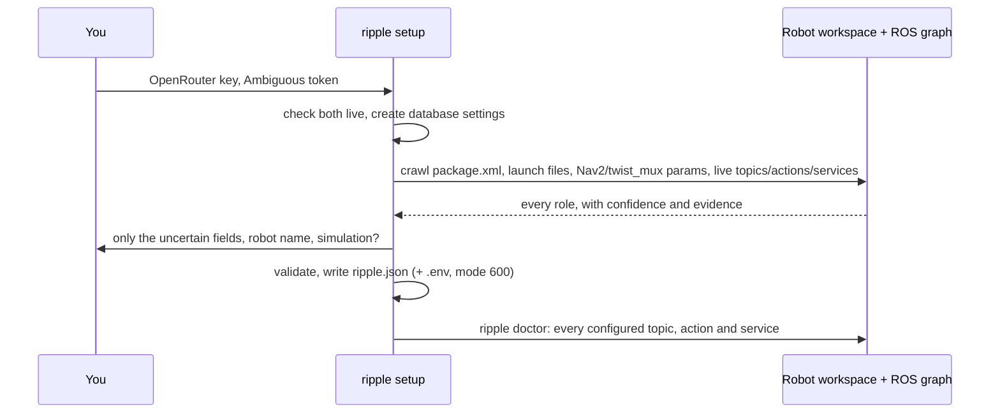

# Ripple

**An always-on site engineer for Nav2 robots.** Ripple watches a deployed robot and notices when it
stops or fails. It works out why from the robot's own evidence, then recovers within limits you set.
When software can't fix what's happening on the floor, it asks a person on
[Ambiguous](https://app.ambiguous.ai). It gets better at each place it works by remembering what fixed
problems there.

- Website and demo video: **[ripple.prabalkhare.com](https://ripple.prabalkhare.com)**
- Guides: [setup](product/docs/setup.md) · [self-improvement](product/docs/self_improvement.md) ·
  [related work](product/docs/literature.md) · [history](docs/HISTORY.md)

> The hackathon submission is tagged [`hackathon-version`](../../tree/hackathon-version). Everything
> after that tag is post-hackathon work.

## What Ripple does

- **Commands in plain words.** "Send the robot to Packing B" just runs: the operator's message is the
  approval. Keepouts come from words ("the aisle past Rack A3 is closed") or from drawing on the map.
  They're verified in the keepout mask and the global costmap before Ripple reports them.
- **Notices trouble on its own.** It spots a stall, a safety hold, a failed goal, lost localization or a
  Nav2 node that went down, and opens an incident with the evidence.
- **Recovers within a bounded ladder.** Clear costmaps, back out with a sensor-guided teleop,
  collision-checked BackUp and Spin, reset a Nav2 node, retry, or re-route through points it chooses.
  Each step has a per-incident budget.
- **Asks a person when it has to.** One specific question on Ambiguous. The reply, in plain language,
  becomes keepouts, station availability and a new destination. The incident closes only on a verified
  arrival: stopped, within tolerance.
- **Improves at its site.** Every closed incident becomes a lesson for that place. Next time, the model
  is briefed with what worked there, what did not, and what the engineer said.
- **Sets itself up.** `ripple setup` finds the robot's topics, actions and services from its workspace
  and the live ROS graph, so a robot with different names still gets a correct configuration.

## How it works



- **The model decides; the edge enforces.** GLM only ever emits tool calls. Every call is validated
  and policy-checked by the edge, then journaled in PostgreSQL before it touches ROS. The robot's own
  safety controller stays above everything Ripple does.
- **Outcomes are verified, not assumed.** A keepout counts once the mask and the costmap show it. An
  arrival counts once odometry has settled and the pose is within tolerance. A recovery counts once
  odometry confirms the motion.

### The incident loop



### The recovery ladder



Budgets are per incident, set in the robot profile: for example, one costmap clear each, two retries,
one lifecycle reset. A step the edge refuses never runs. Ripple never repeats a failed or denied action.

### Safety model

| Level | Examples | Who decides |
|---|---|---|
| Observe | health, logs, diagnostics, route probes | always allowed |
| Recover | clear costmaps, retry, `navigate_via`, lifecycle reset, bounded escape and teleop | automatic within per-incident budgets |
| Command | navigate, keepouts, station availability | an allowlisted operator's message is the approval |
| Never | raw motor commands, shell, disabling collision checks | not exposed |

The teleop safety override exists only for profiles that declare a simulation; the profile validator
refuses it otherwise. Teleop never overrides an e-stop, and always stops inside its minimum clearance.

### Getting better at one site



Lessons follow ExpeL, ReasoningBank, CLIN, Agent Workflow Memory and Generative Agents. The guardrails
come from the memory-poisoning literature:
- lessons are built only from outcomes the edge verified and from allowlisted people;
- each one lists its evidence;
- they're shown to the model as data, never as permissions;
- people can list them and forget them (`GET /api/lessons`, `POST /api/lessons/forget`).

Details: [self_improvement.md](product/docs/self_improvement.md).

## Quick start

Needs Ubuntu 22.04 and ROS 2 Humble. Node.js (for the Ambiguous CLI and the database bridge), Docker
(for PostgreSQL) and Qt6Core (for RosScope) are optional.

```bash
git clone https://github.com/00PrabalK00/ripple && cd ripple
bash product/scripts/install.sh --workspace ~/robot_ws   # install, then guided setup
ripple doctor --site ~/robot_ws/ripple.json              # check config against the live robot
ripple run --site ~/robot_ws/ripple.json                 # agent + dashboard on http://127.0.0.1:8060
```



| Command | What it does |
|---|---|
| `ripple setup` | Guided terminal setup. Add `--non-interactive` to take every answer from flags. |
| `ripple crawl --live [--existing ripple.json]` | Shows what Ripple sees on the robot now, with confidence and evidence per field, and any drift from the file. |
| `ripple doctor --site ripple.json` | Checks the schema, every topic, action and service, drift, and both keys. Exits non-zero on any failure. |
| `ripple run --site ripple.json` | Starts the agent for this robot. |

## Testing

```bash
product/scripts/test_all.sh unit   # 121 offline unit + integration tests, with coverage
product/scripts/test_all.sh tui    # the setup dialogs, driven by keypresses in a pseudo-terminal
product/scripts/test_all.sh live   # against the simulator: doctor, via, recovery, learning, second profile
```

Live evidence lives in `product/evidence/`:

| Check | Result |
|---|---|
| Live recovery (`live-tests-*.json`) | 13/13 on the final code |
| Second robot profile and memory across restarts (`second-profile-*.json`) | 9/9 |
| Via routes and pending keepouts (`via-check-*.json`) | 7/7 |
| Site learning (`learning-check-*.json`) | three incidents at one spot became one lesson (3 successes); recovery went 45 s → 32 s → 30 s |

## Configuration and secrets

- Secrets stay on the machine. `OPENROUTER_API_KEY`, `AMBI_API_TOKEN` and the database password live
  in `.env`, which is gitignored and written with mode 600.
- Each robot has one `ripple.json`: its profile plus the operators and channels allowed to command it.
  It's validated on every start. You can edit it by hand; `ripple doctor` checks it against the robot.
- `product/config/agent.example.json` and `communications.example.json` are templates. The real files
  hold personal ids and addresses and are gitignored.

## Simulator used

Ripple was developed against
[SMR300L Gazebo ROS2 Control](https://github.com/00PrabalK00/smr300l_gazebo_ros2control), an existing
ROS 2 Humble / Gazebo Classic / Nav2 simulator. It supplies the robot, warehouse, maps, zones,
controllers and an independent safety controller. It's an external dependency, **not Ripple's
contribution**, and isn't part of this repository.

Two patches from `patches/` apply to its checkout with `patch -p1`:
- `smr300-speed-units.patch` fixes the speed filter's units.
- `smr300-keepout-publish-on-change.patch` stops the stock keepout publisher re-sending its costmap
  filter info every second. That re-sending made Nav2 rebuild its filter subscriptions under the
  costmap lock, and left `controller_server` and `planner_server` hung during long runs.

## Status and limits

- **Scope:** one robot, in simulation (SMR300 in Gazebo). A second, stock-Nav2 profile runs with no
  code changes. Ripple hasn't been run on physical hardware.
- **Engineer replies:** the Ambiguous reply loop works live. An engineer's replies ("check sensor data
  then use teleop", "force replan") led to teleop, a replan and a verified arrival. In the recorded full
  rehearsal, nobody answered in time, so the reply was typed on the dashboard; that run was 6 of 7
  steps.
- **Localization:** AMCL can lose track while the robot spins in place in a tight dock.
  `ripple doctor` and the timeline make this visible, but recovering from it still needs a person to
  re-seed the pose.
- **Site learning:** it's new. Lessons are matched and upvoted live. Its first measured effect is
  modest: recovery got faster, but a refused step kept repeating. Lessons now record refused steps so
  the next incident can skip them.

## Repository layout

| Path | Contents |
|---|---|
| `product/ripple_edge/` | the ROS 2 edge: observer and detector, typed tools and policy, navigator, keepouts, teleop and escape, crawler |
| `product/agent/` | the agent: orchestrator, GLM client, Ambiguous channel, site memory, dashboard, setup and doctor |
| `product/profiles/` | robot profiles (SMR300 simulation, stock Nav2) |
| `product/scripts/` | `ripple`, `install.sh`, simulator helpers, live checks, demo tooling |
| `product/tests/` | unit and integration tests |
| `product/docs/` | setup, self-improvement and related-work notes |
| `site/` | the website ([ripple.prabalkhare.com](https://ripple.prabalkhare.com)) |
| `db/` | Drizzle schema and migrations for PostgreSQL |
| `ripple/`, `docs/`, `evidence/` | the earlier prototype (see [HISTORY](docs/HISTORY.md)) |
